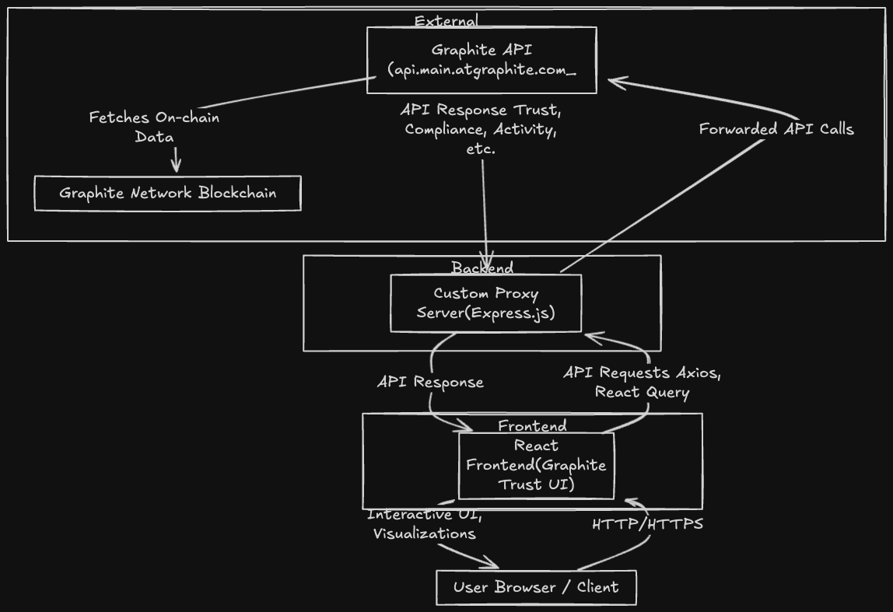

# 🚀 GraphiteTrust: The Web3 Reputation & Compliance Dashboard

<div align="center">
  
  <h2>Decentralized Reputation & Compliance Dashboard for Graphite Network</h2>
  <p>Visualize trust, compliance, and activity for wallets, DAOs, and DeFi projects—powered by the Graphite Network.</p>

  <a href="https://opensource.org/licenses/MIT">
    
  </a>
  <a href="https://react.dev/">
    
  </a>
  <a href="https://docs.main.atgraphite.com/">
    
  </a>
</div>

**GraphiteTrust** is your all-in-one, real-time dashboard for visualizing trust, compliance, and reputation across wallets, DAOs, and DeFi projects on the Graphite Network. Empower your Web3 journey with actionable insights, transparent metrics, and a beautiful, modern interface.

---

## 🌟 Why GraphiteTrust?

In the fast-moving world of Web3, trust and compliance are everything. GraphiteTrust gives you the power to:

- **Instantly assess the trustworthiness** of any wallet, DAO, or project.
- **Monitor compliance and KYC status** in real time—no more guesswork.
- **Spot suspicious activity** before it becomes a problem.
- **Make informed decisions** with confidence, whether you're a user, DAO, DeFi protocol, or auditor.

---

## ✨ Key Features

- 🔍 **Lightning-Fast Search**: Instantly look up wallets, DAOs, or projects and get a full trust & compliance profile.
- 📊 **Real-Time Trust Score Visualization**: See at a glance how reputable an address is, with beautiful, interactive charts.
- 🛡️ **Compliance & KYC Tracking**: Track KYC levels, regulatory status, and compliance history for any entity.
- 🔔 **Live Activity Feed**: Monitor recent transactions and changes in trust/compliance status as they happen.
- 🏆 **Top Wallet Holders**: Discover the most influential and trusted accounts in the ecosystem.
- 📈 **Balance & Mining History**: Visualize balance changes and mined blocks for any address.
- 📱 **Mobile-Ready**: Fully responsive—use it on any device, anywhere.

---

## 🏗️ App Architecture



---

## 🛠️ Quick Start: Setup & Installation

1. **Clone the repository:**
   ```bash
   git clone https://github.com/yourusername/graphite-trust.git
   cd graphite-trust
   ```
2. **Install dependencies:**
   ```bash
   npm install
   ```
3. **Configure your environment:**
   - Copy `.env` and add your Graphite API key:
     ```env
     VITE_GRAPHITE_API_KEY=your_api_key_here
     ```
4. **Start the development server:**
   ```bash
   npm run dev
   ```
5. **Open the app:**
   - Visit [http://localhost:5173](http://localhost:5173) in your browser.

---

## 🗂️ Project Structure

```
src/
  ├── components/     # Reusable React components
  ├── hooks/          # Custom React hooks (data fetching, etc.)
  ├── services/       # API service functions
  ├── types/          # TypeScript type definitions
  ├── App.tsx         # Main application component
  └── main.tsx        # Application entry point
```

---

## 🔌 API Integration

GraphiteTrust seamlessly integrates with the [Graphite API](https://docs.main.atgraphite.com/) to fetch:

- Trust scores & reputation
- Compliance & KYC metrics
- Recent activity & transaction history
- Top wallet holders & mining stats

---

## 💡 Use Cases

- **DAOs & DeFi Projects:** Vet new members, partners, or counterparties with confidence.
- **Auditors & Analysts:** Monitor compliance and risk across the ecosystem.
- **Everyday Users:** Check the trustworthiness of any wallet before transacting.

---

# 🧱 Future Expansion: On-Chain Reputation Registry

## What is it?

A Solidity smart contract that stores and updates wallet/DAO reputation scores, compliance status, and KYC levels directly on-chain.

## Why does it matter?

- **Verifiable & Tamper-Proof:** Trust scores are stored on-chain, making them transparent and immutable.
- **Composable:** Other dApps, DAOs, and DeFi protocols can query and use these scores directly on-chain for access control, whitelisting, or risk management.
- **Compliance & Risk:** Enables compliance checks and risk management for on-chain applications.

## How does it work?

- **Score Updates:**
  - Only an authorized oracle or admin can update reputation, compliance, and KYC scores for any address.
  - All updates are recorded on-chain and can be audited.
- **Attestations:**
  - DAOs or authorized accounts can "attest" or vouch for other addresses, building a web of trust.
  - Attestations are stored and can be queried for transparency.
- **Read Access:**
  - Anyone can read the scores, compliance status, and KYC level for any address.
- **Integration:**
  - Other contracts can call the registry to check scores for access control, whitelisting, or risk management.

## Example Use Cases

- **DeFi Protocols:** Restrict access to users with high trust/compliance scores.
- **DAOs:** Use reputation scores for voting power or membership.
- **KYC/AML:** Enforce compliance requirements for on-chain actions.

## Contract API Overview

- `updateReputation(address, kycLevel, complianceScore, trustScore, reason)` — Update scores (oracle/admin only)
- `addAttestation(address subject, uint256 score, string reason)` — Add a vouch/attestation (attester only)
- `getReputation(address)` — Read scores for any address
- `getAttestationHistory(address)` — Read attestations for any address

## Security & Governance

- Role-based access control for sensitive functions
- All updates and attestations are logged via events
- Emergency pause and admin controls

📂 For full contract details, see `Contract/contracts/ReputationRegistry.sol`.

_This registry is designed to be a foundational building block for decentralized trust and compliance in the Graphite Network and beyond._

---

## 🤝 Contributing

We welcome contributions! To get started:

1. Fork the repository
2. Create your feature branch (`git checkout -b feature/amazing-feature`)
3. Commit your changes (`git commit -m 'Add some amazing feature'`)
4. Push to the branch (`git push origin feature/amazing-feature`)
5. Open a Pull Request

## _Have ideas for new features or want to contribute? Open an issue or pull request!_

## 📄 License

This project is licensed under the MIT License - see the [LICENSE](LICENSE) file for details.

---

## 🌐 Learn More

- [Graphite API Documentation](https://docs.main.atgraphite.com/)
- [Project Demo & Screenshots](#)

> **GraphiteTrust** — Bringing trust, transparency, and compliance to Web3. Try it now and make smarter decisions in the decentralized world!

---
